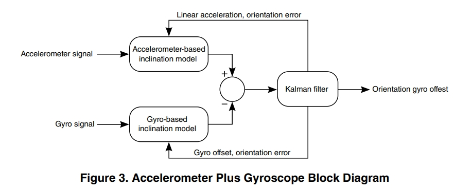

# StreamPhoneData

本仓库利用手机6轴（3轴加速度+3轴陀螺仪）来实时解算手机方位角！AHRS(Attitude and Heading Reference System)算法在MATLAB中实现非常广泛，参考了一些C/C++和MATLAB开源代码[^1],[^2]。

## Notes

1. [Balance-Teapot/](./Balance-Teapot/) 加入了低通butterworth滤波算法，即Mathworks官方示例代码<https://ww2.mathworks.cn/matlabcentral/fileexchange/48954-matlab-to-iphone-made-easy-example-files>，注意该代码只有利用3轴加速度滤波，并没有利用陀螺仪等传感器数据！
1. 对于6轴传感器数据做姿态解算（理论上能得到roll,pitch,tilt,不能得到yaw，此处为参考文献[^3]）推荐使用[`imufilter`](https://www.mathworks.com/help/nav/ref/imufilter-system-object.html)内置函数，因为其融合了间接卡尔曼滤波器算法，而[`ahrsfilter`](https://www.mathworks.com/help/fusion/ref/ahrsfilter-system-object.html)则是对9轴传感器数据做姿态解算，根据参考文献3的PDF文档SensorFusionDatasheet.pdf如下所述：

| Feature                          | Accel Only | Accel + Gyro | Accel + Mag | Accel + Mag + Gyro |  
|----------------------------------|------------|--------------|-------------|---------------------|  
| Filter type                      | Low pass   | Indirect  Kalman    |  Low pass(1)    | Indirect Kalman           |  
| Roll / Pitch / Tilt in degrees   | Yes        | Yes          | Yes         | Yes                 |  
| Yaw in degrees                   | No         | No           | Yes         | Yes                 |  
| Angular rate in degrees/second   | virtual 2 axis | Yes      | virtual 3 axis | Yes                 |  
| Compass heading (magnetic north) | No         | No           | Yes         | Yes                 |

1. More precisely: a non-linear modified exponential low pass quaternion SLERP filter

**Accelerometer Plus Gyroscope**[^3]

Using a gyroscope in addition to an accelerometer yields the ability to smoothly measure rotation in 3D space, although the system can only yield orientation to some random horizontal global frame of reference. That is, the system has no sense of magnetic north. Computation of yaw is not supported by this configuration.This configuration is commonly known as an Inertial Measurement Unit (IMU).

官方示例“Estimate Phone Orientation Using Sensor Fusion”较好，已经修改使用`imufilter`，初步也可以估计位姿，待继续调查使用。

## Getting Started

1. 下载MathWorks官方的[Matlab Mobile™](https://www.mathworks.com/products/matlab-mobile.html)软件并安装到手机上。

> [!NOTE]
> 注意，MathWorks官方的Matlab Mobile™软件是可以免费安装，但是实时传递传感器数据需要License。关于非官方开源的替代软件，可以参考[这里](https://github.com/SjoerdBruijn/StreamPhoneData)[^4]。

## References

[^1]: <https://ww2.mathworks.cn/matlabcentral/fileexchange?q=AHRS>

[^2]: <https://ww2.mathworks.cn/matlabcentral/fileexchange/63149-virtual-reality-drawing-with-android-device?s_tid=srchtitle>

[^3]: <https://github.com/memsindustrygroup/Open-Source-Sensor-Fusion/tree/master/docs>

[^4]: <https://github.com/SjoerdBruijn/StreamPhoneData>
